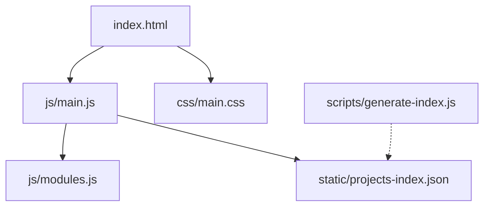

# Diagramas de Arquitetura

Esta pasta é reservada para armazenar representações visuais da arquitetura do projeto "Antigravity".

Recomenda-se o uso de **[Mermaid.js](https://mermaid.js.org/)** para que os diagramas possam ser escritos como código (`.mermaid` ou renderizados diretamente em markdown) e visualizados nativamente no GitHub.

## Exemplo de uso de Mermaid em Markdown:

